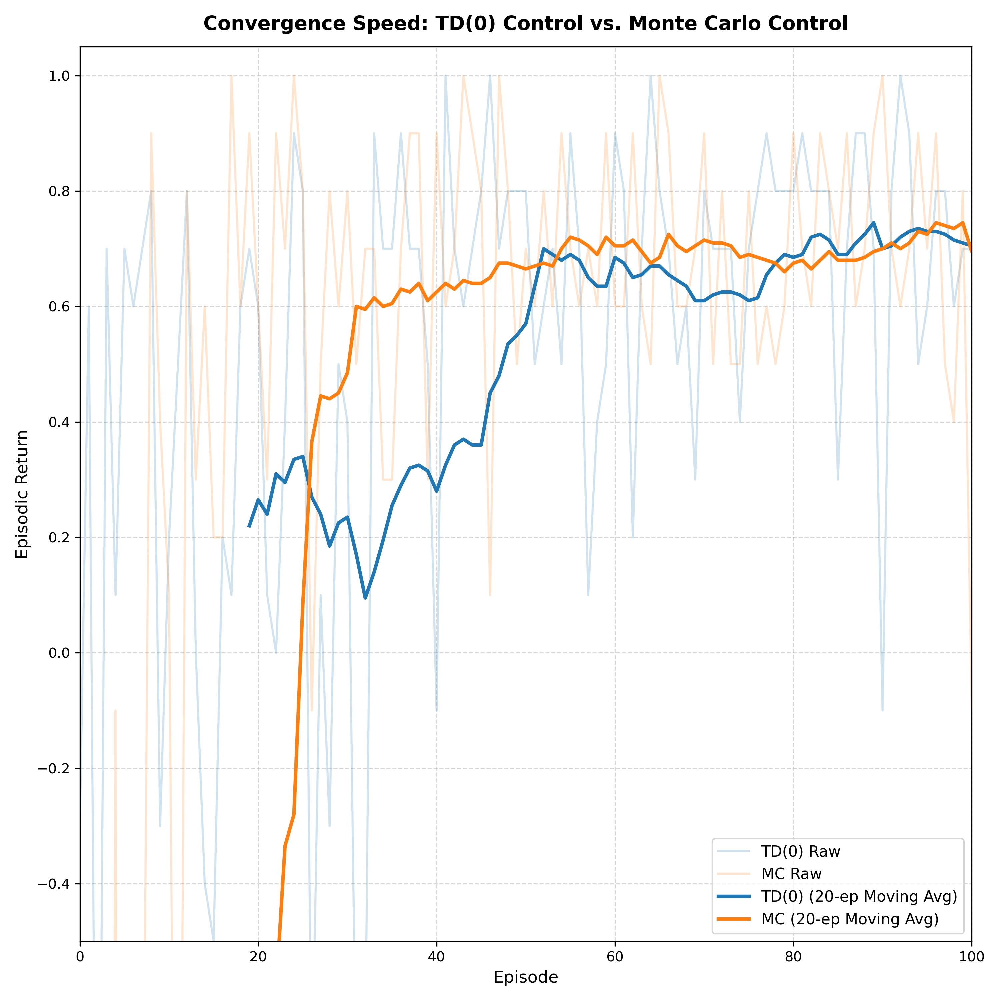
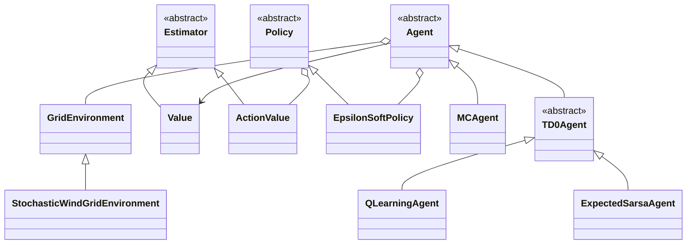

# Monte Carlo and TD(0) Control in a Windy GridWorld

Tabular **Monte Carlo** and **TD(0)** prediction and control on a 5×5 GridWorld with stochastic wind, implemented from scratch (NumPy + Matplotlib only, no RL libraries). The environment and agents live in the `windy_gridworld` package; experiments are run from a Jupyter notebook.



*Smoothed episodic return during the early episodes of training: TD(0) control (Q-learning) reaches good performance faster than Monte Carlo control.*

## Problem

An agent starts in the bottom-left corner `(0, 0)` and must reach the goal in the top-right corner `(4, 4)`. At each step it picks one of four actions (up, down, left, right) and moves one cell, while a random wind may push it off course.

| Element      | Details                                                                                                                                  |
| ------------ | ---------------------------------------------------------------------------------------------------------------------------------------- |
| **Wind**     | With probability 0.9 per step, the agent is pushed 1 or 2 cells. Direction and magnitude depend on the parity of the current row and column (see below). Otherwise there is no wind. |
| **Walls**    | The agent cannot leave the grid: it is clipped back inside and penalised.                                                                |
| **Rewards**  | +1 for reaching the goal, −0.1 for hitting a wall, 0 otherwise                                                                           |
| **Episodes** | End at the goal or after `<!-- TODO: MAX_STEPS -->` steps                                                                                |
| **Discount** | γ = 0.9                                                                                                                                  |

## What's implemented

- **Environments**: `GridEnvironment` (no wind) and `StochasticWindGridEnvironment`
- **Estimators**: tabular state-value `Value` and action-value `ActionValue`, with either sample-average or constant-α updates
- **Policy**: ε-soft policy with optional ε decay
- **Monte Carlo** (`MCAgent`): first-visit or every-visit prediction and control (Sutton & Barto §5.1, §5.4)
- **TD(0)** prediction and control (Sutton & Barto §6.1, §6.5), with three bootstrap targets:
  * `QLearningAgent`: off-policy, bootstraps on `max_a Q(s', a)`
  * `SarsaAgent`: on-policy, bootstraps on `Q(s', a')` with `a'` sampled from the policy
  * `ExpectedSarsaAgent`: bootstraps on the expectation of `Q(s', ·)` under the policy

## Class overview



## Results

Training for 5000 episodes per agent, with ε-decay. Mean and standard deviation of the episodic return over the whole training run:

| Agent          | Mean return | Std dev |
| -------------- | ----------- | ------- |
| Monte Carlo    | 0.82        | 0.18    |
| Q-learning     | 0.79        | 0.16    |
| Expected SARSA | 0.80        | 0.13    |

Takeaways:

- **All three methods reach similar performance.** The differences in mean return are small and come from a single run, so they should not be read as a ranking.
- **TD(0) learns faster early on** (see the figure above). It updates at every step, while Monte Carlo has to wait for the end of each episode.
- **Variance:** Monte Carlo learns from full sampled returns, and Expected SARSA averages over next actions instead of sampling one, so the usual expectation is MC > Q-learning/SARSA > Expected SARSA. The numbers above are consistent with this, but a single run cannot confirm it.
- The standard deviation here is computed over the whole training run, so it also reflects the improvement from early to late episodes, not only run-to-run noise.

> Results come from a single seed and will vary with it. Averaging over many seeds, and reporting statistics over the last N episodes only, is the next planned step (see below).

## How to run

```bash
git clone https://github.com/Michele-Ciavatti/RL---Windy-GridEnvironment.git
cd RL---Windy-GridEnvironment
pip install -r requirements.txt
jupyter notebook notebooks/Control_GridWorld.ipynb
```

Requires **Python 3.11 or newer** (the code uses `StrEnum` and `match` statements).

Run the cells top to bottom. The notebook imports the environment and agents from `windy_gridworld/` and saves value-function heatmaps and the convergence plot to `figures/`.

## Repository structure

```
.
├── notebooks/
│   └── analysis.ipynb            # experiments and plots
├── windy_gridworld/              # environments, estimators, policy, agents
├── figures/                      # generated plots
├── requirements.txt
├── LICENSE
└── README.md
```

## Possible extensions

- Average results over many seeds and add confidence bands
- Report statistics over the last N episodes instead of the whole run
- Compare constant-α and sample-average updates for MC
- Plot the learned greedy policy as arrows on the grid

## Acknowledgements

The GridWorld setup and parts of the code are adapted from the Reinforcement Learning Laboratories by Alberto Sinigaglia, Unipd, 2025–2026.

Algorithm descriptions follow R. S. Sutton and A. G. Barto, *Reinforcement Learning: An Introduction*, 2nd ed. (2018).

## License

Released under the [MIT License](LICENSE).
